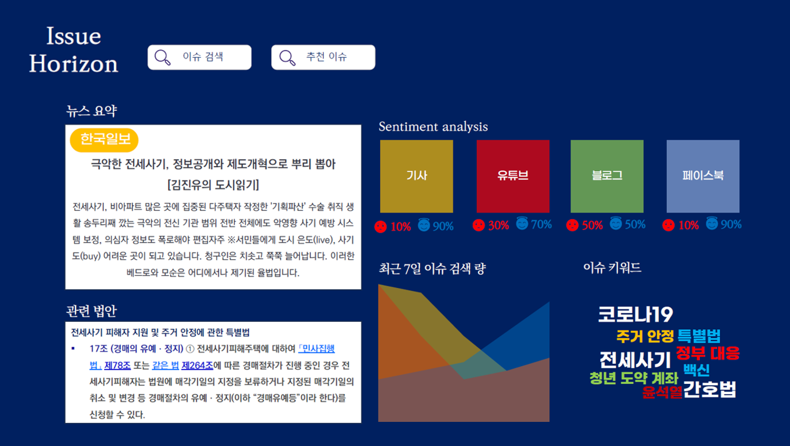

# IssueHorizon
이 프로젝트는 AI 모델 학습을 기반으로 이용자가 뉴스 내용을 쉽고 빠르게 습득할 수 있도록 하고, 각 매체를 통해 여러 관점을 파악하며, 생소한 법률 용어와 법안을 이해할 수 있도록 돕는 것을 목적으로 한다. 

따라서 우리는  "Issue Horizon"이라는 사이트를 제작하여 기사 내용을 요약 및 시각화하고, 각 매체 데이터를 분석해 이슈에 대한 사람들의 감정적인 반응을 한 눈에 확인할 수 있게 할 것이다. 더불어 기사와 연관된 법률적 지식도 제공할 것이다.

이를 위해 웹 크롤링을 통해 기사 및 법률 데이터를 수집하고, BERT 모델을 사용하여 감정 분석, 문서 요약 등을 수행한 뒤 Tableau를 사용하여 웹사이트에 정리한 데이터를 시각화한다.

이 웹사이트를 통해 이용자들은 타인의 반응으로부터 기사에선 얻지 못했던 정보를 얻을 수 있고, 여러 사람의 의견을 간편하게 수합할 수 있다. 



# 프로젝트 사용 방법
구글 Colab으로 열어서 사용하기: 
<a target="_blank" href="https://colab.research.google.com/github/Gwakcy0/IssueHorizon/blob/master/codes/sample_bert.ipynb">
  
</a>

혹은 gitHub 클론하고 다음 명령어 치기
```bash
pip install -r requirements.txt
```
나중에 프로젝트 완성하고 다음 명령어로 환경을 업데이트해 주자.
```bash
pip freeze > requirements.txt
```

그리고 다시 내부에서 kpfbert를 clone해 준다.
```bash
git clone https://github.com/KPF-bigkinds/KPF-BERT.git
move KPF-BERT kpfbert
```

# 목표
## 1. 사회 이슈의 변화, 사람들의 감정 표현
- 크롤링한 데이터가 엑셀 형식으로 주어짐
- 감정분석을 통해 미디어별로 찬반 반응 파악

## 2. 연관 하위 이슈 파악
- Optional. 시간이 남으면 하는 걸로
 
## 3. 사회 현안으로서 이슈와 법률의 상관 관계 분석
Question answering 방식
- 트레이닝 셋 구축 - AI {문제:정답}, ....
- 사회 현안 "간호법 ...." : 재정된 법률 1-1000 -> 1: 30%, 2:0%, 3:1%
- -> 법률 {1, 7, 8}

고려해야 할 점 
- 뉴스 기사는 재정된 게 아니라, 입법하려고 하는 법이 이슈가 된다.
- 트레이닝 셋을 구축하기 매우 어려우므로 비지도학습을 사용하거나 더 쉬운 방법을 찾는 것이 좋다.
- 예시: 사회 현안 -> 참고 문헌 용도: {국민의힘, 민주당, ...} 찬반, 재정하려고 하는 법률 링크

 
# 분야별 책임자
- 프론트엔드: 조아연
- 백엔드: 김가은, 윤시우
- AI: 곽찬영
 

